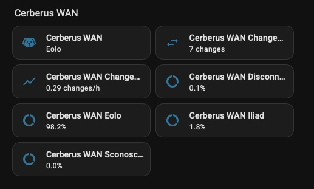
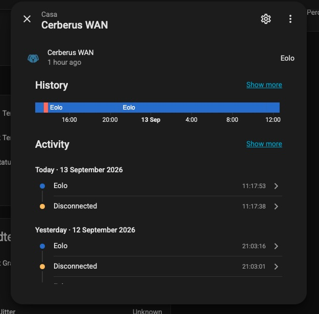

# Cerberus WAN

**Which provider is carrying your traffic right now?**

A Home Assistant integration that answers that one question, on any line, with
no account and no API key. Two DNS queries and a table you write yourself.

[](https://my.home-assistant.io/redirect/hacs_repository/?owner=drake69&repository=cerberus-wan&category=integration)

[](https://drake69.github.io/cerberus-wan/)
[](https://github.com/drake69/cerberus-wan/actions/workflows/validate.yml)
[](LICENSE)
[](https://github.com/drake69/cerberus-wan)

**Does this answer a question your router would not? Leave a star.** It costs
you one click and it is most of how the next person with two lines finds it.



The line in use has a name, and every other sensor is about that name. Because
the name is an ordinary state, the history comes with it:



## Why it exists

If you have two internet connections, nothing already in the house tells you
which one is actually carrying the traffic.

The gateway integration reports the primary WAN and only that: when the primary
falls over, the public address it reports becomes `0.0.0.0` while the house is
happily browsing through the backup. A speedtest names the provider but runs
once a day, so it samples nothing. Reading it off the latency or the first hop
works, and has to be redone by hand every time something changes.

Cerberus WAN asks the outside world instead of asking the router: the public
address as seen from outside, then who announces that address. The answer is
the provider whose cable the traffic is on, whatever the router believes.

## Philosophy

Eight rules. Everything in here follows from them, and anything that fights
them does not get built.

**Super simple.** It does one thing. No speedtest, no graphs, no network
diagnostics, no per interface counters. One sensor that names the provider,
and the few statistics that come free once you are already watching it.

**No key, no service.** No account, no API key, no quota, no registration, no
terms of service. Nothing here can be discontinued, rate limited or put behind
a paywall, because there is no third party to do it: the whole integration is
two DNS queries. If DNS works, this works.

**No complication.** No YAML, no template sensor to copy, no router to log
into. One dialog with one field that matters, and it opens with the network
you are on already in it, waiting for a name. Setup is typing that name.

**Any hardware.** It asks the outside world, not the router. There is no OID to
hunt for, no vendor API to authenticate against, no model specific template to
copy. Whatever carries your lines, and whatever brand it is, the public address
seen from outside is the same evidence.

**It says when it does not know.** `Unknown` is an answer, not an error, and it
is kept apart from `Disconnected`: one means the traffic gets out through a
network you have not named, the other means nothing gets out at all. It never
guesses which line you are on to avoid admitting it cannot tell.

**Nothing is lost on a restart.** The change window and the record of who
carried what are written to disk and picked up again on start. A statistic
that resets whenever Home Assistant does is a statistic that lies. The stretch
that was open when Home Assistant went down keeps its provider, because the
line is not known to have moved while nobody was watching.

**Quiet when nothing happens.** The address is asked every 15 seconds, but who
owns it is answered from a local table for 30 days, and the statistics are
written only when a number actually moves. A line that does not switch costs
no state writes at all: watching a quiet day does not grow your database.

**One objective: watch your WAN switch.** Not bandwidth, not uptime, not
quality of service. The question is which line is carrying the traffic right
now, and the moment it changes. Anything that does not serve that question
stays out.

## Installation

### HACS

This integration is not in the default HACS store, so it is installed as a
custom repository. The link below opens it directly on your instance:

[](https://my.home-assistant.io/redirect/hacs_repository/?owner=drake69&repository=cerberus-wan&category=integration)

Download it from there, then restart Home Assistant and add the integration:

[](https://my.home-assistant.io/redirect/config_flow_start/?domain=cerberus_wan)

If the link does not work, add the repository by hand: **HACS**, the menu in the
top right, **Custom repositories**, then `drake69/cerberus-wan` with category
**Integration**.

### Manual

Copy `custom_components/cerberus_wan` into your Home Assistant `config`
directory, restart, then add the integration from **Settings**, **Devices and
services**, **Add integration**.

### First run

The dialog opens with the network you are going out through already in the
table, without a name, and a link that says whose it is. Give it a name and
save. That is the whole setup.

## What it reports

| State | Meaning |
|---|---|
| The provider label you configured | the announcing network matched a row in your table |
| `Disconnected` | nothing gets out |
| `Unknown` | traffic gets out, but the announcing network is not in your table |

`Unknown` is a first class answer, not an error. It is the honest state when the
integration cannot tell, and it is deliberately distinct from `Disconnected`.

Both labels are configurable, so you can phrase them in your own language.

## The entities

| Entity | What it holds |
|---|---|
| the provider sensor | the label of the network in use, with the address and the ASN as attributes |
| one share sensor per label | the percentage of the recorded day that provider carried the traffic, with an `active` attribute saying whether it is carrying right now |
| `Changes in 24 hours` | how many times the provider changed in the last 24 hours, as a moving window |
| `Changes per hour` | the same window divided by its width: the moving average of switchovers per hour |

The shares are percentages of what is on the record, not of the wall clock. An
installation running for two hours can only speak for those two hours, so the
provider sensor publishes `covered_hours` beside the label: a share of 100% is
worth reading only next to how long the record reaches back. Once the record
covers a full day, the shares are shares of the last twenty four hours.

The statistics are recomputed the moment a change happens, and swept once an
hour so that a change leaves the window on time. They are written only when the
number actually moves, so a quiet line costs no state writes at all. Both the
window and the timeline are kept across a restart: a statistic that resets
whenever Home Assistant does is a statistic that lies. The segment that was
open when Home Assistant went down keeps its label, because the line is not
known to have moved while nobody was watching.

Losing the line counts as a change, because it is one, and the time spent
disconnected is a share like any other.

## Reacting to a change

Two ways, and you can use either or both.

**Pick an automation or a script in the dialog.** The field accepts both, and
several of each. An automation is triggered with its own conditions still in
force, so one that says "only at night" still means it. A script receives what
changed as variables.

**Or trigger on the event.** Every switchover fires
`cerberus_wan_provider_changed`, whether or not anything was hooked to it:

```yaml
trigger:
  - platform: event
    event_type: cerberus_wan_provider_changed
action:
  - service: notify.mobile_app
    data:
      message: "Now on {{ trigger.event.data.label }}, was {{ trigger.event.data.previous_label }}"
```

The event carries `previous_label`, `label`, `public_address`, `asn`,
`changed_at` and `entry_id`. Use it when the automation needs to know where the
traffic went; use the field when it just needs to run.

**An automation attached this way does not show up under "Related".** That card
lists automations, scripts and scenes whose own configuration names this
service, and here the reference points the other way: the automation knows
nothing about Cerberus WAN, it is Cerberus WAN that calls it, and the link
lives in the integration options. An automation triggered on the event is
invisible there too, since an event trigger names no entity. Only one that
triggers on the state of the provider sensor appears in that card. To see what
is attached, reopen the dialog: the field holds the list.

## How it works

Two DNS queries, asked at very different rates:

1. Every **15 seconds**, `myip.opendns.com` asked of the OpenDNS resolvers
   returns the public address seen from the outside. This is the question that
   detects a switchover, so it is the one asked often.
2. **Only when that address is one it has not seen before**, the Team Cymru DNS
   service is asked which autonomous system announces it.

The answer to the second question is kept in a local table, alongside the date
it was obtained, and reused for **30 days**. An address does not change owner,
so asking again on every cycle would be four identical questions a minute for
an answer that holds for months. A lookup that failed is retried within the
hour instead, so a moment of DNS trouble does not become thirty days of an
unknown provider.

The table lives in the Home Assistant storage directory and survives a restart.
Addresses not seen for 60 days are dropped from it.

The number is then looked up in your table.

**There is no third party API.** No key, no quota, no registration, no terms of
service, nothing that can be discontinued or put behind a paywall. If DNS works,
this works.

## Adding a provider you do not know yet

You do not need to research anything, and you do not need to be quick about
it. Every network the integration has gone out through is offered in the
options dialog, without a name, ready to be given one: the network in use
first, then the ones seen before it. A backup line can therefore be named the
day after the failover, not only during the few minutes it was carrying the
traffic.

```
35612 = Eolo;
30722 = ;
```

Fill in the name and save. Accepted forms for the number are `35612`,
`AS35612` and `as 35612`.

Each row is closed by a semicolon. That is what lets a row end at the end of
the line or at the semicolon, whichever comes first, and it is not decoration:
without it, two providers that end up on one line are read as one, and the
number of the second lands inside the name of the first.

```
35612 = Eolo; 30722 = Fastweb;    one line, two providers
35612 = Eolo 30722 = Fastweb      one provider named "Eolo 30722 = Fastweb"
```

Rows that cannot be read are skipped, so a typo costs one provider rather than
a dialog that will not close.

If you would rather read the number off the sensor yourself, it is published
as an attribute:

```
asn: 35612
public_address: 203.0.113.20
```

## Requirements

Home Assistant 2024.6.0 or later, and outbound DNS on port 53 to the OpenDNS
resolvers and to `cymru.com`. Nothing else.

## Development

```bash
uv sync
uv run pytest
uv run ruff check .
```

### Layout

```
domain/          the model: Asn, ProviderTable, Observation, WanMonitor, ports
infrastructure/  the adapters: DNS lookups, the system clock
assembly.py      the composition root: entry in, wired monitor out
sensor.py        Home Assistant entities, thin
config_flow.py   Home Assistant dialogs, thin
```

Nothing under `domain/` imports Home Assistant or a DNS library: it reaches the
outside world only through the protocols in `domain/ports.py`. That is why the
test suite runs the whole model against fakes, with no network and no Home
Assistant installed.

## If it is useful, say so

**Star the repository.** A custom integration is not in the default store, so
it is found by search and by word of mouth, and the star count is most of what
either has to go on. One click.

Going further:

- something wrong, or a provider that will not resolve? [Open an issue](https://github.com/drake69/cerberus-wan/issues).
- running it on a line neither of the two it was written against? Say which
  network and which country in an issue. That is the report the project most
  needs and cannot produce on its own.

## Licence

MIT. See [LICENSE](LICENSE).

The three headed dog is built from the `dog` glyph of
[Material Design Icons](https://pictogrammers.com/library/mdi/) by
Pictogrammers, licensed Apache-2.0, which is also the icon the provider sensor
carries. See [NOTICE](NOTICE).

---

Developed with the support of Claude Code (Anthropic).
